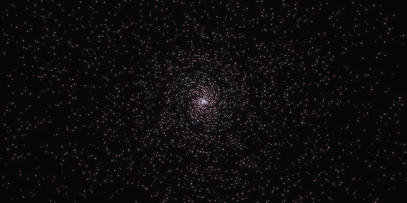

# Primes

Plotting prime numbers in polar coordinates.
With some, hopefully, visually pleasing animations.\
Inspired by [this video](https://www.youtube.com/watch?v=EK32jo7i5LQ) by 3Blue1Brown.

Visit the Live Demo [here](https://jannik4.github.io/primes/).

## Controls

- **Zoom in**: <kbd>&uarr;</kbd>
- **Zoom out**: <kbd>&darr;</kbd>
- **Reset zoom**: <kbd>Space</kbd>

<!---->

- **Increase speed**: <kbd>Ctrl</kbd> / <kbd>Shift</kbd>
- **Reset time**: <kbd>R</kbd>

<!---->

- **Fullscreen**: <kbd>F11</kbd>
- **Display FPS**: <kbd>F12</kbd>

## Screenshots

There are some example screenshots available in the [releases](https://github.com/jannik4/primes/releases).\
You can also make screenshot with custom resolution, time and zoom level by running the program with the following arguments:

```sh
cargo run -r -- screenshot --width $width --height $height --time $time --zoom $zoom
```

<p align="center">
  
</p>

## License

Licensed under either of

- Apache License, Version 2.0
  ([LICENSE-APACHE-2.0](LICENSE-Apache-2.0) or <http://www.apache.org/licenses/LICENSE-2.0>)
- MIT License
  ([LICENSE-MIT](LICENSE-MIT) or <http://opensource.org/licenses/MIT>)

at your option.
