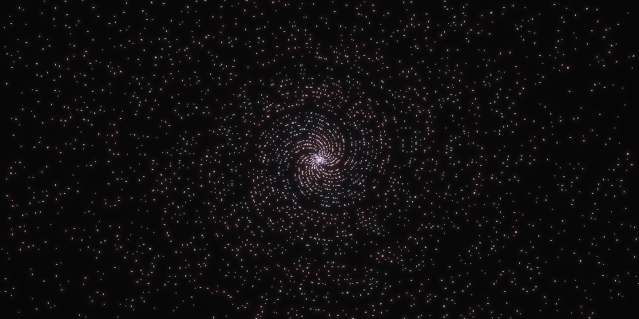

# Primes

Plotting prime numbers in polar coordinates.
With some, hopefully, visually pleasing animations.

Inspired by [this video](https://www.youtube.com/watch?v=EK32jo7i5LQ) by 3Blue1Brown.

  

## License

Licensed under either of

- Apache License, Version 2.0
  ([LICENSE-APACHE-2.0](LICENSE-Apache-2.0) or <http://www.apache.org/licenses/LICENSE-2.0>)
- MIT License
  ([LICENSE-MIT](LICENSE-MIT) or <http://opensource.org/licenses/MIT>)

at your option.
